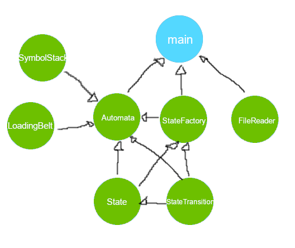

## Assignment 1 of Complejidad Computacional

Marcos Jesús Barrios Lorenzo

alu0101056944

Automata por vaciado de pila. No se ha implementado el requisito opcional de modo traza.

- [Estructura](#structure)
- [Program Architecture](#program-architecture)

### This repository is structured as follows

```
    |- include Header files of source code
    |- src Source code files
    |- CMakeLists.txt CMake configuration to compile the project
```


### Program Architecture

First, <code>main.cc</code> uses a *FileReader* to build a *StateFactory*. The latest allows concise creation of *State* objects which contain  *StateTransition* objects that store the transition info. Both *SymbolStack* and *LoadingBelt* are used by Automata to recognize the input word with an algorithm that keeps a state history stack and takes advantage of each state's capability to remember it's applied transitions.

